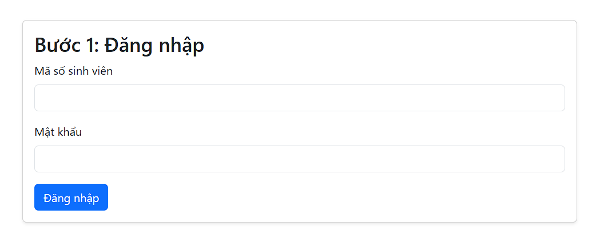
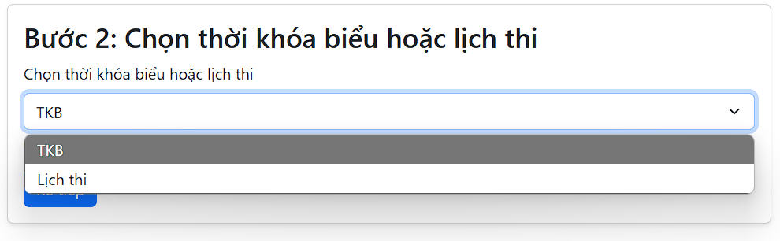
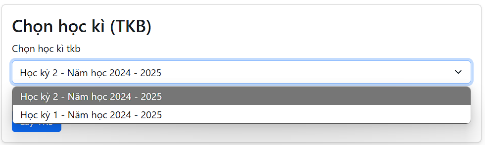
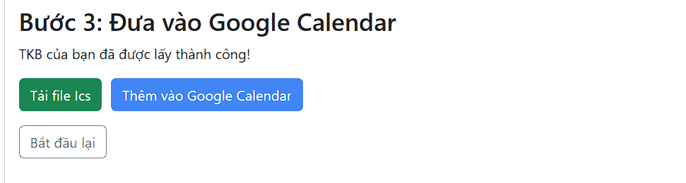
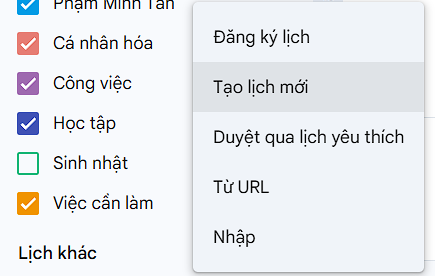
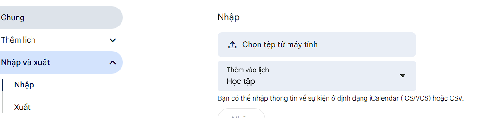

# Hướng Dẫn Sử Dụng Công Cụ Chuyển TKB và Lịch Thi của Trường ĐH Nông Lâm Sang Google Calendar

Chào mừng bạn đến với công cụ hỗ trợ chuyển đổi thời khóa biểu (TKB) và lịch thi từ trang dkmh.hcmuaf.edu.vn sang định dạng ICS để nhập vào Google Calendar. Hướng dẫn này sẽ giúp bạn từng bước thực hiện quá trình này một cách dễ dàng.

## Bước 1: Đăng Nhập

1.  **Truy cập trang web:** Mở trình duyệt web của bạn và truy cập vào trang web công cụ.

2.  **Nhập thông tin đăng nhập:**
    *   Bạn sẽ thấy giao diện **Bước 1: Đăng nhập**.
    *   Điền **Mã số sinh viên** vào ô "Mã số sinh viên".
    *   Điền **Mật khẩu** tài khoản dkmh của bạn vào ô "Mật khẩu".

      *(Thay thế `./images/step1_login_form.png` bằng đường dẫn ảnh chụp màn hình form đăng nhập)*

3.  **Nhấn nút "Đăng nhập":** Sau khi nhập đầy đủ thông tin, nhấn vào nút **"Đăng nhập"**.

4.  **Chờ xử lý:** Hệ thống sẽ tiến hành đăng nhập vào hệ thống dkmh. Quá trình này có thể mất vài giây. Nếu đăng nhập thành công, bạn sẽ được chuyển sang **Bước 2**. Nếu đăng nhập thất bại, vui lòng kiểm tra lại thông tin đăng nhập và thử lại.

## Bước 2: Chọn Thời Khóa Biểu hoặc Lịch Thi

1.  **Giao diện Bước 2:** Sau khi đăng nhập thành công, bạn sẽ thấy giao diện **Bước 2: Chọn thời khóa biểu hoặc lịch thi**.

2.  **Chọn loại lịch:**
    *   Sử dụng hộp chọn **"Chọn thời khóa biểu hoặc lịch thi"**.
    *   Chọn **"TKB"** nếu bạn muốn chuyển thời khóa biểu theo dạng tuần.
    *   Chọn **"Lịch thi"** nếu bạn muốn chuyển lịch thi.

     *(Thay thế `./images/step2_choose_type.png` bằng đường dẫn ảnh chụp màn hình giao diện chọn loại lịch)*

3.  **Nhấn nút "Kế tiếp":** Sau khi chọn loại lịch mong muốn, nhấn vào nút **"Kế tiếp"**.

## Bước 2.1: Chọn Học Kỳ (TKB hoặc Lịch Thi)

Tùy thuộc vào lựa chọn ở **Bước 2**, bạn sẽ chuyển đến một trong hai giao diện sau:

### Bước 2.1 (TKB): Chọn Học Kỳ (TKB)

1.  **Giao diện Bước 2.1 (TKB):** Nếu bạn chọn **"TKB"** ở Bước 2, bạn sẽ thấy giao diện **"Chọn học kì (TKB)"**.

2.  **Chọn học kỳ:**
    *   Sử dụng hộp chọn **"Chọn học kì tkb"**.
    *   Chọn học kỳ bạn muốn chuyển đổi sang Google Calendar từ danh sách các học kỳ được tải về.

     *(Thay thế `./images/step2_1_tkb_semester.png` bằng đường dẫn ảnh chụp màn hình chọn học kỳ TKB)*

3.  **Nhấn nút "Lấy TKB":** Sau khi chọn học kỳ, nhấn vào nút **"Lấy TKB"**. Hệ thống sẽ tải dữ liệu thời khóa biểu của học kỳ đã chọn.

### Bước 2.1 (Lịch Thi): Chọn Học Kỳ (Lịch Thi)

1.  **Giao diện Bước 2.1 (Lịch Thi):** Nếu bạn chọn **"Lịch thi"** ở Bước 2, bạn sẽ thấy giao diện **"Chọn học kì (Lịch thi)"**.

2.  **Chọn học kỳ:**
    *   Sử dụng hộp chọn **"Chọn học kì lịch thi"**.
    *   Chọn học kỳ bạn muốn chuyển đổi lịch thi sang Google Calendar từ danh sách các học kỳ được tải về.

     *(Thay thế `./images/step2_1_exam_semester.png` bằng đường dẫn ảnh chụp màn hình chọn học kỳ lịch thi)*

3.  **Nhấn nút "Lấy TKB":**  Mặc dù nút này có nhãn "Lấy TKB", nhưng khi bạn chọn "Lịch thi", hệ thống sẽ tải dữ liệu lịch thi của học kỳ đã chọn. Nhấn vào nút **"Lấy TKB"** để tiếp tục.

## Bước 3: Đưa vào Google Calendar

1.  **Giao diện Bước 3:** Sau khi hệ thống tải thành công dữ liệu TKB hoặc lịch thi, bạn sẽ thấy giao diện **Bước 3: Đưa vào Google Calendar**.

2.  **Tải file ICS hoặc Nhập vào Google Calendar:**

    *   **Tải file ICS:** Nhấn nút **"Tải file Ics"** để tải file ICS về máy tính của bạn. Bạn có thể sử dụng file này để nhập lịch vào bất kỳ ứng dụng lịch nào hỗ trợ định dạng ICS, bao gồm Google Calendar, Outlook Calendar, v.v.

         *(Thay thế `./images/step3_download_import_buttons.png` bằng đường dẫn ảnh chụp màn hình các nút tải và nhập)*

    *   **Thêm vào Google Calendar:** Nhấn nút **"Thêm vào Google Calendar"**. Nút này sẽ thực hiện đồng thời việc tải file ICS và mở trang hướng dẫn nhập lịch vào Google Calendar (xem phần **Hướng Dẫn Nhập Lịch vào Google Calendar** bên dưới).

3.  **Hoàn tất:** Sau khi tải file ICS hoặc nhấn "Thêm vào Google Calendar", bạn đã hoàn thành quá trình chuyển đổi.

## Hướng Dẫn Nhập Lịch vào Google Calendar (Nếu chọn "Thêm vào Google Calendar" hoặc tải file ICS)

1.  **Mở Google Calendar:** Truy cập vào Google Calendar của bạn (calendar.google.com) và đăng nhập nếu cần.

2.  **Tạo lịch mới (khuyến khích):**
    *   Ở cột bên trái, tìm mục **"Lịch khác"** hoặc **"My calendars"** phía dưới bên góc trái màn hình.
    *   Nhấn vào biểu tượng **"+"** (Thêm lịch khác) và chọn **"Tạo lịch mới"** hoặc **"Create new calendar"**.
    *   Đặt tên cho lịch mới (ví dụ: "TKB HCMUAF" hoặc "Lịch Thi HCMUAF") và tùy chỉnh các thiết lập khác nếu muốn. Nhấn **"Tạo lịch"** hoặc **"Create calendar"**.

     *(Thay thế `./images/google_calendar_create_calendar.png` bằng đường dẫn ảnh chụp màn hình Google Calendar menu tạo lịch mới)*

3.  **Nhập lịch:**
    *   Sau khi tạo lịch mới (hoặc nếu bạn muốn nhập vào lịch hiện có), ở cột bên trái, tìm mục **"Cài đặt"** (biểu tượng bánh răng) và chọn **"Cài đặt"** hoặc **"Settings"**.
    *   Chọn **"Nhập & Xuất"** hoặc **"Import & Export"** từ menu bên trái trong trang cài đặt.
    *   Nhấn vào nút **"Chọn tệp từ máy tính của bạn"** hoặc **"Select file from your computer"**.
    *   Chọn file ICS bạn vừa tải về (thường có tên `tkb_exported.ics` hoặc `exam_exported.ics` trong thư mục tải xuống).
    *   Chọn lịch mà bạn muốn nhập vào từ danh sách thả xuống **"Thêm vào lịch"** hoặc **"Add to calendar"**. Nếu bạn đã tạo lịch mới ở bước 2, hãy chọn lịch đó.
    *   Nhấn nút **"Nhập"** hoặc **"Import"**.

     *(Thay thế `./images/google_calendar_import_ics.png` bằng đường dẫn ảnh chụp màn hình Google Calendar trang nhập lịch ICS)*

4.  **Hoàn tất nhập lịch:** Google Calendar sẽ tiến hành nhập các sự kiện từ file ICS vào lịch bạn đã chọn. Sau khi quá trình nhập hoàn tất, bạn sẽ thấy thời khóa biểu hoặc lịch thi hiển thị trên Google Calendar của mình.

## Bắt Đầu Lại

Nếu bạn muốn thực hiện lại quá trình chuyển đổi với tài khoản khác hoặc học kỳ khác, bạn có thể nhấn nút **"Bắt đầu lại"** ở **Bước 3**. Hệ thống sẽ đưa bạn trở lại **Bước 1: Đăng nhập**.

## Lưu Ý

*   **Bảo mật:** Thông tin đăng nhập của bạn chỉ được sử dụng để lấy dữ liệu TKB và lịch thi từ trang dkmh. Chúng tôi không lưu trữ hoặc chia sẻ thông tin này.
*   **Sai sót dữ liệu:** Công cụ này hoạt động dựa trên dữ liệu được cung cấp từ trang dkmh. Nếu có sai sót trong dữ liệu gốc, lịch trên Google Calendar có thể không hoàn toàn chính xác. Vui lòng kiểm tra lại lịch sau khi nhập.
*   **Kết nối mạng:** Để công cụ hoạt động, bạn cần có kết nối internet ổn định.

Chúc bạn sử dụng công cụ thành công và có một lịch học tập hiệu quả!